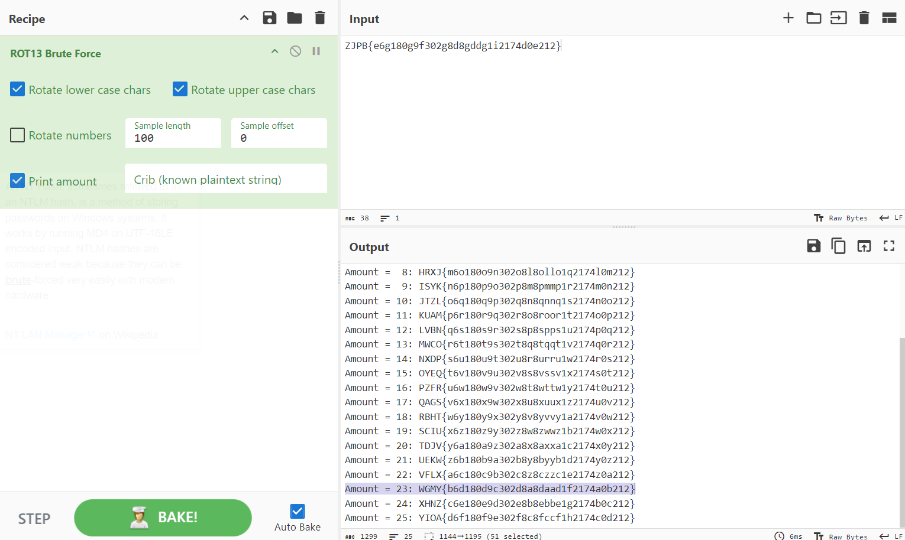
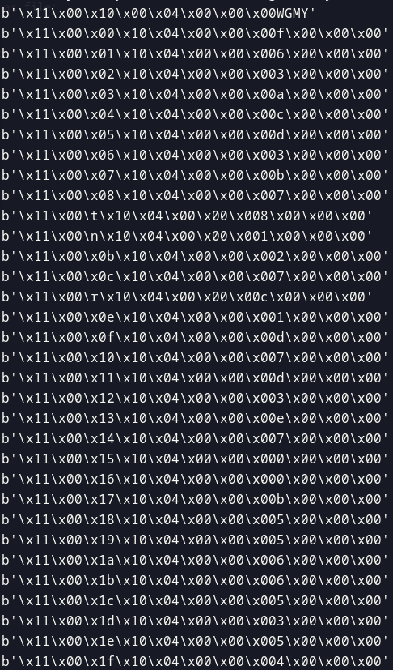
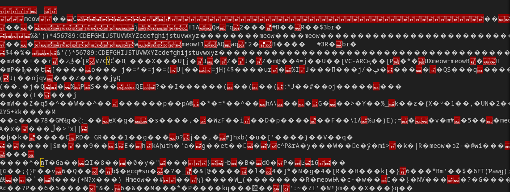
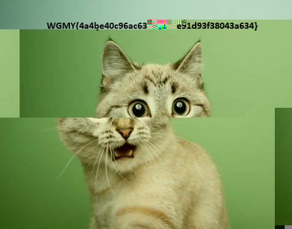
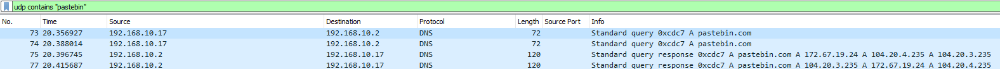
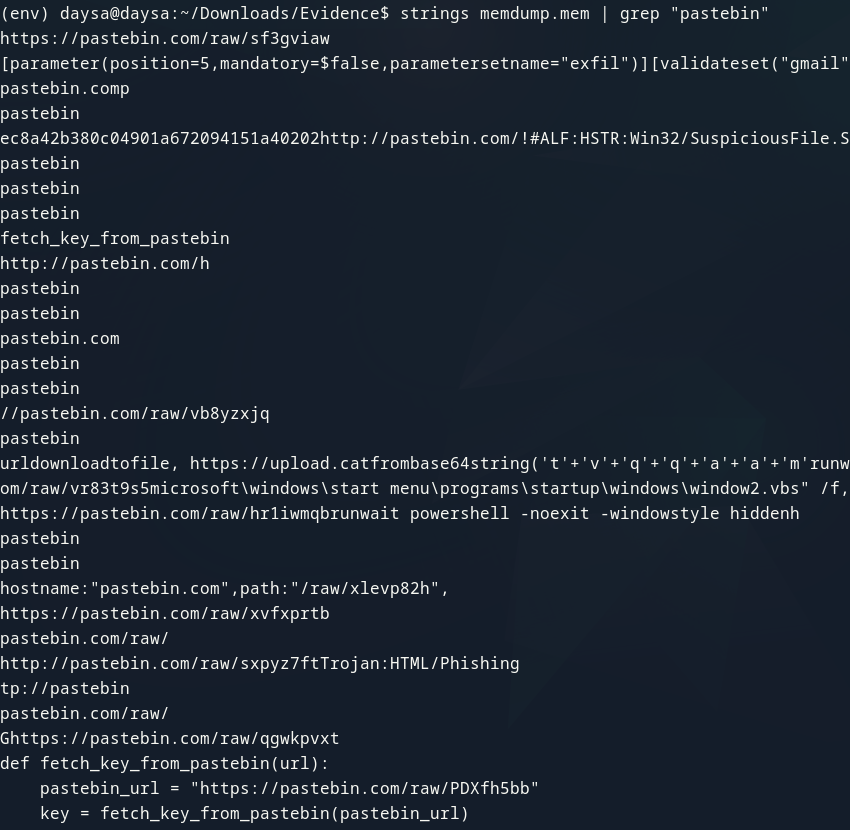
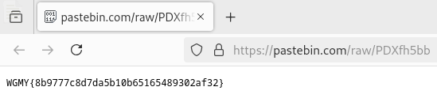

# Wargames.MY CTF 2024

> **27/12/2024 17:00 CEST - 28/12/2024 17:00 CEST**


# Criptografía


## Credentials

> **120/266 soluciones | 50 puntos**

**Enunciado**

    We found a leak of a blackmarket website's login credentials. Can you find the password of the user osman and successfully decrypt it?

**Archivos**

    user.txt

```
engineerrissoles
icebunt
fruitfultry
celebritypentathlon
galoshesopinion
favorboeing
bindingcouch
...
```

    passwd.txt

```
CMPTmLrgfYCexGzJu6TbdGwZaadfaf000F3C
000C74C1101B855AF786BF71028F266A3233
0007A10807AF25582731FE310CAB300A5541
kaL36YJtvZMdbTdLuQRx84t85i2174d0e212
00005A5C1779551FDF91410835B1C66A9880
rYrtRbkHvJzPmDwzD6gSDbAE3105098CF651
kfcVXjcFkvNQQPpATErx6eVDdC74C1101B85
...
```


### Resolución

Se presenta un archivo de texto con diferentes usuarios y otro con contraseñas. En el enunciado se indica que debemos buscar la contraseña del usuario ```osman```.

Las contraseñas parecen estar almacenadas en diferentes sistemas de codificación, como base64, hexadecimal... Revisando el fichero, en la línea 337, hay una contraseña que llama especialmente la atención.

```
...
95c0fb8dc010f92cc302c05e54449be3bhghb
435103d556b55ce6a206423d61f8d610ghaad
ZJPB{e6g180g9f302g8d8gddg1i2174d0e212}
mRuTNPuN3xNvyPb4XQqqXcteN4d6ba9953fgd
2d4fe01bfd9e5c4e939183d2381bda91c3cfv
...
```

Tiene el formato de la flag y parece estar rotada. Haciendo fuerza bruta de todas las posibles rotaciones seleccionamos la que cumple con el prefijo.

<p align="center">
     
</p>

> **flag: WGMY{b6d180d9c302d8a8daad1f2174a0b212}**


## Rick'S Algorithm

> **24/266 soluciones | 477 puntos**

**Enunciado**

    My friend Rick designed an alogrithm that is super secure! Feel free to try it!

**Archivos**

    server.py

```python
from Crypto.Util.number import *
import os
from secret import revealFlag
flag = bytes_to_long(b"wgmy{REDACTED}")

p = getStrongPrime(1024)
q = getStrongPrime(1024)
e = 0x557
n = p*q
phi = (p-1)*(q-1)
d = inverse(e,phi)

while True:
	print("Choose an option below")
	print("=======================")
	print("1. Encrypt a message")
	print("2. Decrypt a message")
	print("3. Print encrypted flag")
	print("4. Print flag")
	print("5. Exit")

	try:
		option = input("Enter option: ")
		if option == "1":
			a = input("Enter message to encrypt: ")
			print(bytes_to_long(a.encode()))
			m = bytes_to_long(a.encode())
			print(f"Encrypted message: {pow(m,e,n)}")
		elif option == "2":
			c = int(input("Enter ciphertext to decrypt: "))
			if c % pow(flag,e,n) == 0 or flag % pow(c,d,n) == 0:
				print("HACKER ALERT!!")
				break
			print(f"Decrypted message: {pow(c,d,n)}")
		elif option == "3":
			print(f"Encrypted flag: {pow(flag,e,n)}")
		elif option == "4":
			print("Revealing flag: ")
			revealFlag()
		elif option == "5":
			print("Bye!!")
			break
	except Exception as e:
		print("HACKER ALERT!!")
	
```


### Resolución

Se trata de un sistema de cifrado RSA en el que podemos cifrar, descifrar e imprimir la flag cifrada. 

En la funcionalidad de descifrado impide que el texto sea módulo la flag cifrada o que la flag divida el resultado del descifrado. De esta manera, impiden que se hagan los ataques comunes a este tipo de sistemas, como enviar el inverso modular del texto cifrado o $k^e \cdot c$ que resultaría en $k \cdot m$ (o eso fue lo que pensamos en primera instancia).

En este ejercicio también desconocemos $n$, aunque existen diferentes maneras de recuperarlo. 

Nuestro primer enfoque fue basado en la observación de que $e = 1367$. Esta $e$ permite el Hastad's Broadcast Attack, si se consiguen $k$ mensajes cifrados con diferentes $n$, siendo $k = e$. Según teorema chino del resto, se puede encontrar una única solución de $m^e$ tal que:

$$m^e \equiv \sum_{i = 1}^{e} c_i \cdot b_i \cdot b_i^{\prime} \bmod N$$

Siendo $b_i = \frac{N}{n_i}$, $b_i^{\prime} \equiv b_i^{-1} \bmod n_i$ y $N$ el producto de todos los módulos.

La tarea de obtener los textos cifrados y los módulos no era trivial, ya que suponía 1367 conexiones únicas al servidor remoto. Paralelizando la tarea en una hora se obtenían todos los textos.

Para la recuperación del módulo $n$ se utilizaron los métodos descritos en este [enlace](https://crypto.stackexchange.com/questions/65965/determine-rsa-modulus-from-encryption-oracle/65967#65967).

Así, y para evitar el problema de los enteros pequeños, se calculó:

$$n = gcd(gcd(2^e - E(2), 3^e - E(3)), gcd(E(2)^2 - E(3), E(3)^2 - E(9)))$$

Una vez se tienen los 1367 módulos y mensajes cifrados se aplica teorema chino del resto y la raíz de $e$ al resultado.

```python
from pwn import *
from Crypto.Util.number import *
from math import gcd
from tqdm import tqdm
from sympy import integer_nthroot
from sympy.ntheory.modular import crt
import json
import os
import time

context.log_level = "CRITICAL"
SAVE_FILE = "results.json"
MAX_RETRIES = 3


def load_results():
    if os.path.exists(SAVE_FILE):
        with open(SAVE_FILE, "r") as f:
            data = json.load(f)
        return data.get("Ns", []), data.get("cts", [])
    return [], []


def save_results(Ns, cts):
    current_data = set(zip(Ns, cts))
    new_data = list(zip(Ns, cts))
    
    if len(current_data) < len(new_data):
        raise ValueError("Duplicado detectado, lanzando reintento.")
    
    with open(SAVE_FILE, "w") as f:
        json.dump({"Ns": Ns, "cts": cts}, f)


def get_flag(r):
    r.recvuntil(b"Enter option: ")
    r.sendline(b"3")
    r.recvuntil(b"Encrypted flag: ")
    return int(r.recvline().strip())


def encrypt(r, pt):
    r.recvuntil(b"Enter option: ")
    r.sendline(b"1")
    r.recvuntil(b"Enter message to encrypt: ")
    r.sendline(long_to_bytes(pt))
    r.recvuntil(b"Encrypted message: ")
    return int(r.recvline().strip())


def recover_n(e, r):
    two = encrypt(r, 2)
    three = encrypt(r, 3)
    four = encrypt(r, 4)
    nine = encrypt(r, 9)
    n = GCD(GCD(pow(2, e) - two, pow(3, e) - three), GCD(pow(two, 2) - four, pow(three, 2) - nine))
    return n


def worker_task():
    retries = 0
    while retries < MAX_RETRIES:
        try:
            r = remote("43.217.80.203", 34100)
            ct = get_flag(r)
            N = recover_n(e, r)
            return N, ct
        except Exception as ex:
            retries += 1
            print(f"Error en worker_task, reintento {retries}/{MAX_RETRIES}: {ex}")
            time.sleep(1)
    raise RuntimeError(f"worker_task falló después de {MAX_RETRIES} intentos")


Ns, cts = load_results()
e = 0x557

for _ in tqdm(range(e - len(Ns)), desc="Procesando tareas"):
    try:
        N, ct = worker_task()
        
        if (N, ct) in zip(Ns, cts):
            raise ValueError("Par duplicado detectado, reintentando.")
        
        Ns.append(N)
        cts.append(ct)
        save_results(Ns, cts)
    except Exception as ex:
        print(f"Error en el procesamiento de una tarea: {ex}")

M, _ = crt(Ns, cts)
print(integer_nthroot(M, e))
```

Tras la competición, leyendo las soluciones del resto de equipos, vimos que se podía solucionar enviando $k^e \cdot c$, siempre y cuando el texto resultado del descifrado fuera mayor que la flag.

> **flag: wgmy{ce7a475ff0e122e6ac34c3765449f71d}**


## Rick'S Algorithm 2

> **8/266 soluciones | 498 puntos**

**Enunciado**

    Someone crack our algorithm! We fixed it, hopefully its secure now..

**Archivos**

    server.py

```python
from Crypto.Util.number import *
import os
from secret import revealFlag
flag = bytes_to_long(b"wgmy{REDACTED}")

p = getStrongPrime(1024)
q = getStrongPrime(1024)
e = 0x557
n = p*q
phi = (p-1)*(q-1)
d = inverse(e,phi)

while True:
	print("Choose an option below")
	print("=======================")
	print("1. Encrypt a message")
	print("2. Decrypt a message (Disabled)")
	print("3. Print encrypted flag")
	print("4. Print flag")
	print("5. Exit")

	try:
		option = input("Enter option: ")
		if option == "1":
			m = bytes_to_long(input("Enter message to encrypt: ").encode())
			print(f"Encrypted message: {pow(m,e,n)}")
		elif option == "2":
			print(f"Disabled decryption to prevent flag leaking!")
		elif option == "3":
			print(f"Encrypted flag: {pow(flag,e,n)}")
		elif option == "4":
			print("Revealing flag: ")
			revealFlag()
		elif option == "5":
			print("Bye!!")
			break
	except Exception as e:
		print("HACKER ALERT!!")
	
```


### Resolución

La diferencia entre este ejercicio y el anterior es que el descifrado es deshabilitado. Afortunadamente, el reto anterior lo resolvimos con el método por el que estaba pensando resolver este, por lo que únicamente tuvimos que esperar de nuevo una hora para extraer todos los módulos y conseguir una de las tres first bloods que logramos en esta competición.

> **flag: wgmy{1ee240ab7db21db1268c3e1e44fee9a0}**


# Miscelánea

## The DCM Meta

> **66/266 soluciones | 310 puntos**

**Enunciado**

    [25, 10, 0, 3, 17, 19, 23, 27, 4, 13, 20, 8, 24, 21, 31, 15, 7, 29, 6, 1, 9, 30, 22, 5, 28, 18, 26, 11, 2, 14, 16, 12]

**Archivos**

    challenge.dcm
```
Fichero binario.
```


### Resolución

El formato DCM es un formato muy usado por todo el mundo para almacenar imágenes médicas.

Este ejercicio no parece estar basado en este tipo de formato, como se puede ver por la corta longitud del archivo adjunto, teniendo 396 bytes de longitud.

Observando bien la estructura del binario se puede ver un patrón cada 12 bytes:

<p align="center">
     
</p>

Los últimos 4 bytes parecen tener información de la flag, mientras que el tercero parece un índice. Este índice marca el orden por el que hay que ordenar los caracteres hexadecimales, siguiendo la lista del enunciado del ejercicio.

```python
values = [25, 10, 0, 3, 17, 19, 23, 27, 4, 13, 20, 8, 24, 21, 31, 15, 7, 29, 6, 1, 9, 30, 22, 5, 28, 18, 26, 11, 2, 14, 16, 12]

with open('challenge.dcm', 'rb') as file:
    file = file.read()

binary_lines = []
for i in range(12, len(file), 12):
    binary_lines.append(file[i:i+12])

flag = ""
for value in values:
    flag += chr(binary_lines[value][-4])

print("WGMY{" + flag + "}")
```

> **flag: WGMY{51fadeb6cc77504db336850d53623177}**


# Forense

## Unwanted Meow

> **63/266 soluciones | 328 puntos**

**Enunciado**

    Uh.. Oh.. Help me, I just browsing funny cats memes, when I click download cute cat picture, the file that been download seems little bit wierd. I accidently run the file making my files shredded. Ughh now I hate cat meowing at me.

**Archivos**

    flag.shredded

```
    Fichero de imagen corrupto.
```


### Resolución

Este ejercicio proporciona un fichero de imagen JFIF que parece estar corrupto. Abriéndolo con cualquier editor de texto se puede ver la palabra ```meow``` repetidas veces por todo el archivo.

<p align="center">
     
</p>

Eliminando dicha palabra de todo el archivo:

<p align="center">
     
</p>

Conociendo la longitud de un hash MD5 se sabe que faltan justo 2 caracteres hexadecimales, 16 posibles combinaciones. Cuando íbamos a comenzar a probar todas las combinaciones un compañero buscó la primera parte del hash en internet y encontró en github que era la palabra ```meow``` en MD5.

> **flag: WGMY{4a4be40c96ac6314e91d93f38043a634}**


## Tricky Malware

> **22/266 soluciones | 481 puntos**

**Enunciado**

    My SOC detected there are Ransomware that decrypt file for fun. The script kiddies is so tricky. Here some evidence that we successfully retrieve.

**Archivos**

    memdump.mem

```
    Captura de memoria.
```

    network.pcap

```
    Captura de tráfico de red.
```


### Resolución

Se proporcionan dos archivos: una captura de una memoria y una captura de tráfico de red. 

La captura de tráfico de red tiene 217 paquetes, en los que hay poca información que llame la atención. Lo único interesante son algunos paquetes DNS que resuelven a la página de pastebin.

<p align="center">
     
</p>

Con eso en mente, comenzamos a enumerar datos relevantes en la memoria utilizando volatility. Listamos procesos, conexiones remotas, posibles ejecuciones de la cmd, además de probar a lanzar el comando ```string memdump.mem | grep "pastebin"```.

<p align="center">
     
</p>

Entre estas ocurrencias, hay un enlace de pastebin que contiene la flag:

<p align="center">
     
</p>

> **flag: WGMY{8b9777c8d7da5b10b65165489302af32}**